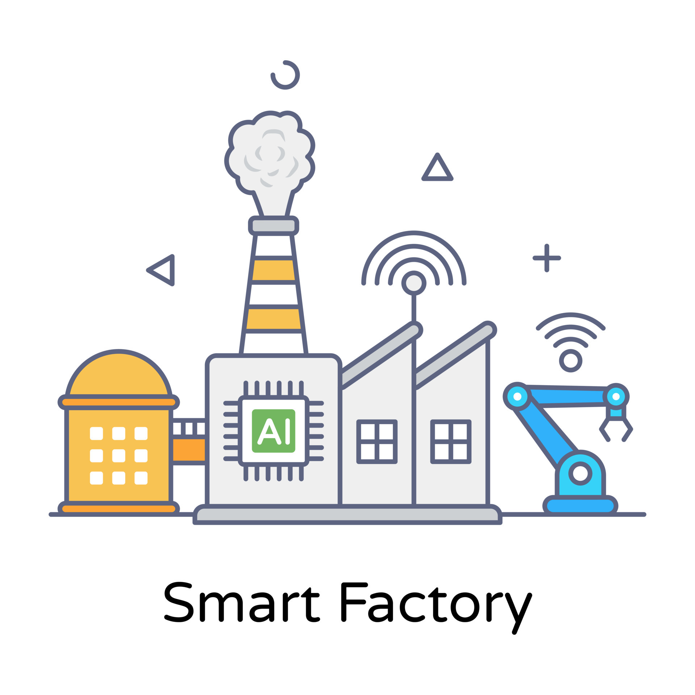
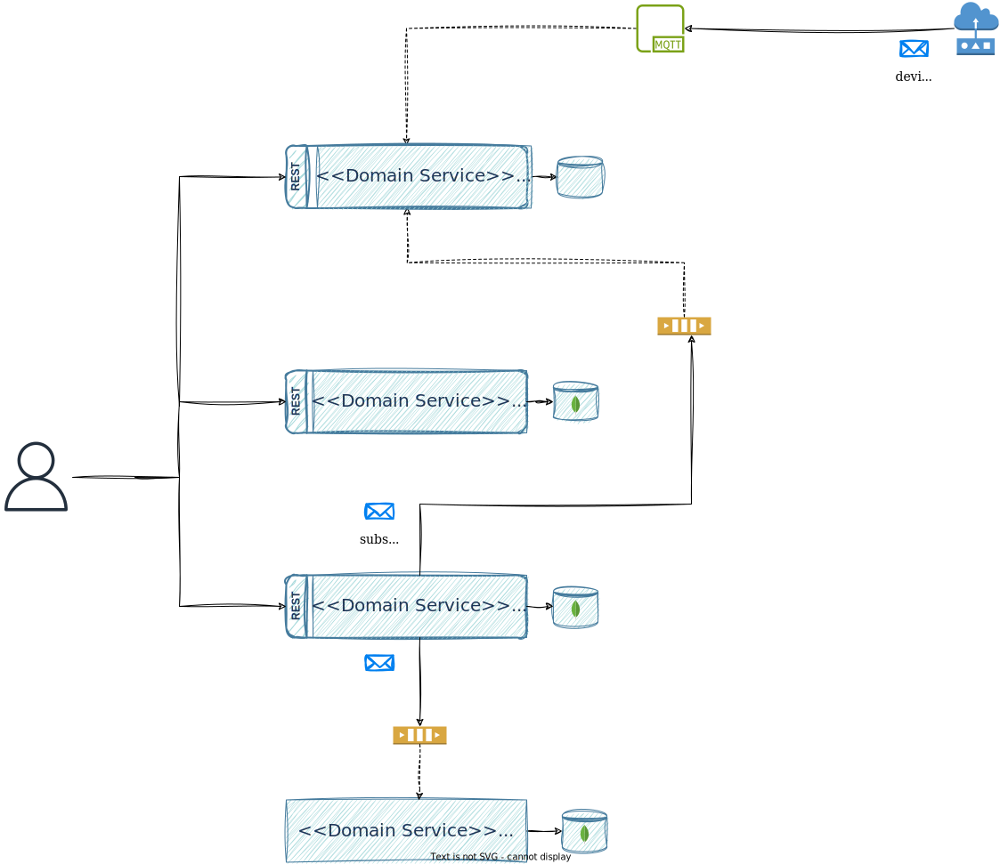

# Smart Factory Platform v2

Version 2 of the Smart Factory Platform project. This version is a complete rewrite of the original project, with a focus on improving the architecture and design of the system.
First version of the project can be found [README.md](./README.md).

## Content
- [High-level description](#high-level-description)
- [Architectural concepts](#architectural-concepts)
- [Architectural diagrams](#architectural-diagrams)
  - [Software architecture diagram](#software-architecture-diagram)

## High-level description
Smart Factory is an IoT platform that allows users to monitor, verify, manage, and control sensors, modules, and smart devices in various environments, such as Smart Cities and Smart Environments. This project was born out of my passion for technology, microservices, cloud computing, and the Internet of Things.

The main purpose of this project is educational, and I am using it to learn and experiment with various technologies and tools. I am constantly improving the documentation and looking for the best solutions for the project.

Services provided by the platform:
- **Data Collector Service** - collects data from sensors and devices and stores it in a time series database
- **Subscription Service** - allows users to subscribe or register to sensor data and receive notifications when the data changes
- **User Management Service** - handles user data and authentication
- **Notification Service** - sends notifications to users via email or other channels

## Architectural concepts
The Smart Factory Platform is built using a microservices architecture, which allows for scalability, availability, and flexibility. The platform is designed to handle large amounts of data and provide real-time monitoring and control of sensors and devices.

Some of the architectural concepts and patterns used in this project include:
- Event-driven architecture, Layered architecture
- API-driven development
- REST architectural style
- Caching
- Outbox pattern

## Architectural diagrams

### Software architecture diagram

